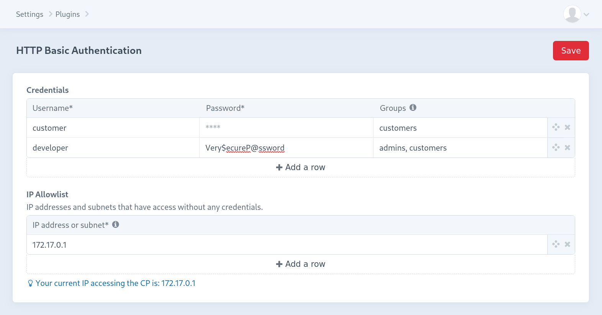

# HTTP Basic Authentication for Craft CMS 3.x


A plugin for Craft CMS that provides HTTP Basic Authentication (BasicAuth) within templates.

## Requirements

 * Craft CMS >= 3.2.0

## Installation

Open your terminal and go to your Craft project:

``` shell
cd /path/to/project
composer require codemonauts/craft-basicauth
./craft install/plugin basicauth
```

### Apache
I you are using Apache to host your CraftCMS, you have to tell Apache to pass the `Authorization` header (which contains the basic auth data) to PHP (See the [Dokumenation](https://httpd.apache.org/docs/trunk/mod/core.html#cgipassauth)). Otherwise Craft will never see any credentials and will continue to show you the dialog to enter your username and password. This can either be set directly in the Apache config file or in your `.htaccess`:

```
CGIPassAuth on
```

## Settings

On the settings page in the control panel you can add credentials to use for authentication.



You can add a list of IP addresses and subnets (v4 and v6) that have access without any credentials. Use the [CIDR notation](https://en.wikipedia.org/wiki/Classless_Inter-Domain_Routing#CIDR_notation) for subnets.

These settings supports the project config if enabled. 

##  Tag

In your templates you can require BasicAuth:

```twig

 ```

### Parameters

The `` tag supports the following parameters:`

#### `require`

This specifies the type of check to be made. You can check against a single `user`, a `group` of user, any `valid` user and also accept `any` provided credentials. 

```twig
{# require a single user #}


{# require the user to be a member of a group #}


{# accept any valid credentials #}


{# accept any credentials without checking them #}

```

This parameter is **required**.

#### `site`

This specifies the site handle for which the authentication should be made. The Authentication is only enforced when the current site handle is the same as specified.

```twig
{# require the user "bob" if the current site handle is "acme" #}

```

#### `env`

This specifies the environment for which the authentication should be made. The Authentication is only enforced when the current environment is the same as specified.

```twig
{# require the user to be a member of the group "customer" if the current environment is "stage" #}

```

#### `if`

Only activates the BasicAuth if a certain condition is met.

```twig

```

## Globals

This plugin provides two global variables with the credentials of the user:

```twig
<p>Hello {{ basicAuthUsername }}!</p>
<p>Your password is: {{ basicAuthPassword }}</p>
```

## Why should I use this plugin and not the webserver module?

May you ask yourself why you should use this plugin and not the Basic Authentication provided by the webserver? Here are some aspects:

1. You have full control of the Basic Authentication without your DevOps friends.
2. You can add the `` wherever you need it: In your central layout for all pages or only in one special template with some fancy conditions.
3. You can use conditions from Craft. For example: ``

With ❤ by [codemonauts](https://codemonauts.com)
